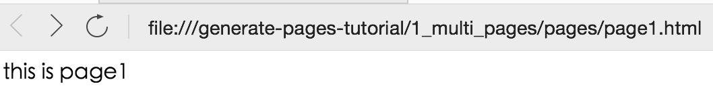

使用 webpack 已经将近一年了，期间用它构建过4、5个项目，踩过一些坑，现在用自己的理解记录下来。

我做了一个 webpack 开发多页面的脚手架 https://github.com/fe-config/generate-pages ，你可以试试看。现在我根据这个项目讲解怎么使用 webpack 开发多页面项目。

## 1. 基本配置

```shell
cd 1_multi_pages
cnpm install
npm run build
```

查看 `webpack.config.js` 可以其实就是配置多个 entry 而已，可以看到 `dist` 下生成编译好的文件：

```
|--- dist
        |--- page1
                |--- main.js
        |--- page2
                |--- main.js
```

这里的目录层级和 entry 中的模块名(`page1/main`、`page2/main`)对应。

打开 `pages/page1.html` 和 `pages/page2.html` 就可以看到我们的js模块生效了：




关于 webpack 是什么，有什么作用我就不介绍了，网上一搜一大堆。不过网上搜到的多数是怎么使用 webpack 开发 React 或者 Vue，但其实使用 webpack 开发多页面也是很方便的，因为 webpack 本质就是一个打包工具。


## 入口 entry

```js
entry: {
    'vendor': [
        'jquery'
    ],
    'page1/main': [
        './src/page1/main'
    ],
    'page2/main': [
        './src/page2/main'
    ]
}
```

多页面其实就是多入口，`page1/main`、`page2/main` 对应一个页面的主 js 逻辑，`vendor` 是每个页面都会用的模块，这里是 `jquery`。然后使用 `ProvidePlugin` 就可以不在每个模块中 `import` 他们而直接使用 `$` 了：

```js
new webpack.ProvidePlugin({
    $: 'jquery'
})
```

然后使用 `webpack.optimize.CommonsChunkPlugin` 插件

```js
new webpack.optimize.CommonsChunkPlugin('vendor','vendor.js'),
```

## 模块映射资源和模板

入口每个模块都定义好了之后，接下来就是就是把每个页面的模块与

## webpack-dev-server


